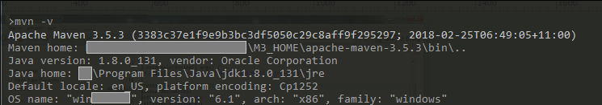
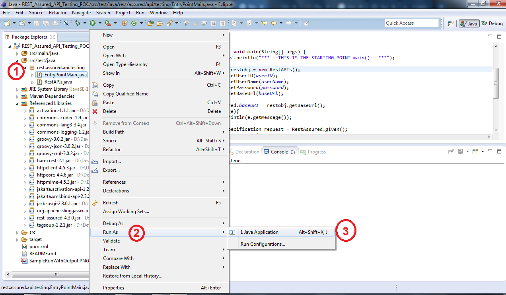
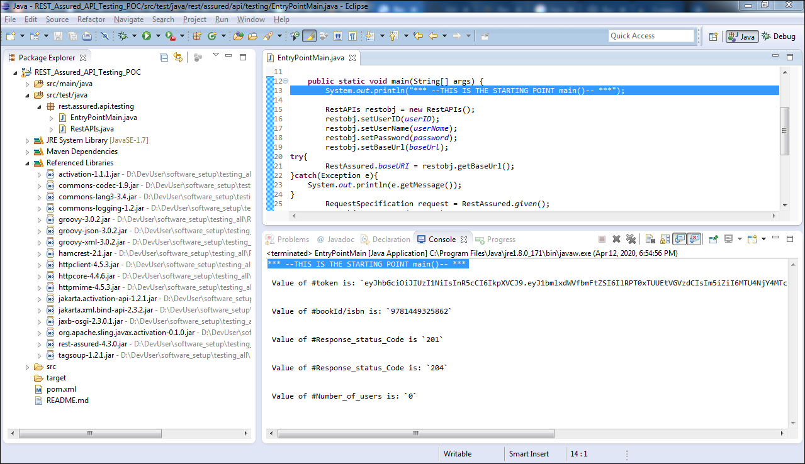

# Here is more HELP! (to run this project...)

---
## 1.Making Sure your `JAVA` and `Maven` is all set !

---
## 2. How to Run this Project from Eclipse IDE

---
## 3. This is how a Sample Output looks like

--- 

Lets go Back to Previous(main) [README.md]

[\\]: <> (This is a commented section and should not be visible in README file)

[README.md]: <../README.md>